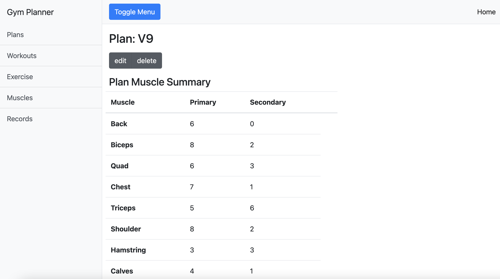

# Exercise Planner and Progress Tracker

Welcome to the Exercise Planner and Progress Tracker repository! This web service is designed to help you plan your exercises, track your progress, and achieve your fitness goals effectively.

## Features

### Planning Workouts

- Create comprehensive exercise plans with a hierarchical structure.
- Plans consist of workouts, workouts consist of exercises.
- Each exercise affects a primary muscle and may also engage secondary muscles.

### Summary Overview

- View a summary that illustrates how your plans target different muscle groups.
- Get insights into your overall workout routine and muscle engagement.

### Workout Tracking

- Log the number of times you perform each workout.
- Monitor your workout consistency and stay on top of your fitness routine.

### Exercise Records

- Keep track of your personal records for each exercise.
- Record your best performance for each exercise and strive for improvement.

### Categorized Exercise List

- Access a categorized list of your exercises.
- Group exercises based on muscle categories for easy reference and analysis.


## Getting Started

1. Clone the repository to your local machine.
   ```
   git clone https://github.com/your-username/exercise-planner.git
   ```

2. Explore the code and set up the web service on your preferred environment.

## Screenshots


*List of exercises categorized by muscle groups.*


*Overview of a workout.*


*Summary of a plan muscle targets.*


*Overview of the plan.*

## Contributing

Contributions are welcome! If you have ideas for improvements or new features, please open an issue or submit a pull request.
